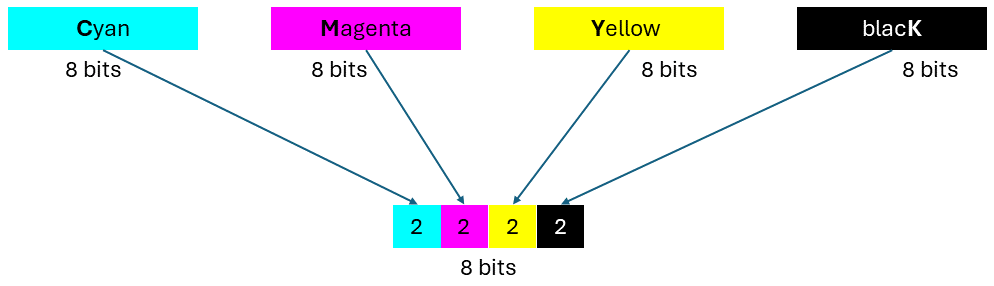
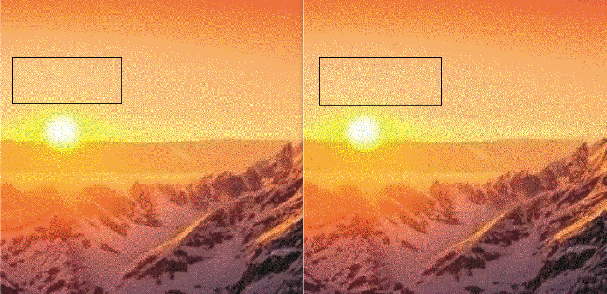

# Projet de dithering

## 1. Contexte

Dans le contexte de traitement d'images numériques, le dithering est une technique utilisée pour réduire les artefacts visuels, tels que le "banding" ou l'effet de "moire", qui peuvent apparaître lors de la réduction du nombre de couleurs dans une image.

Lorsque vous réduisez le nombre de couleurs dans une image, par exemple lors de la conversion d'une image haute résolution en une image avec moins de couleurs pour une utilisation sur le web ou dans des applications mobiles, vous risquez de perdre des détails et de créer des transitions abruptes entre les couleurs adjacentes. Cela peut entraîner l'apparition de bandes de couleurs visibles, en particulier dans les dégradés de couleur.

Le dithering consiste à ajouter un léger bruit aléatoire à l'image pour créer l'illusion de plus de couleurs ou de nuances, même si le nombre de couleurs réelles reste limité. Ce bruit aléatoire aide à masquer les transitions abruptes entre les couleurs et à rendre les dégradés de couleur plus lisses et plus naturels.

Voici un exemple : la **_Figure 1_** représente l'image originale, tandis que la **_Figure 2_** montre l'image après l'application d'un algorithme de dithering.


Figure 1 : Image d'origine


Figure 2 : Image avec dithering

## 2. Cmyk Image

CMYK et RGB sont deux modèles de couleur utilisés dans la reproduction des couleurs, mais ils sont utilisés dans des contextes différents.

CMYK fait référence aux couleurs primaires utilisées dans l'impression : Cyan, Magenta, Jaune et Noir (Key).
Ce modèle est largement utilisé dans l'industrie de l'impression, où les couleurs sont superposées en couches pour créer une gamme étendue de teintes.
Dans notre modèle CMYK, chaque couleur est représentée par une valeur, allant de **0** (absence de couleur) à **255** (couleur pleine). En combinant différentes quantités de ces quatre encres, il est possible de reproduire une grande variété de couleurs.

Ainsi, chaque couleur est représentée par un octet, et l'ordre des couleurs est le suivant : cyan (C), magenta (M), jaune (Y) et noir (K). Pour une image de dimensions, par exemple, de 50 pixels de large et 50 pixels de haut, la taille de cette image devrait être de 10 000 octets.

## 3. Objectifs du Projet

### 3.1 Compresser les couleurs

Comme expliqué dans la partie 2, chaque pixel est représenté par 4 octets. L'objectif du projet est d'utiliser un seul octet pour représenter quatre couleurs différentes. Ainsi, nous attribuons les deux premiers bits pour représenter la couleur C, les 2 bits suivants pour la couleur M, et ainsi de suite, comme illustré dans la **_Figure 3_**.



Figure 3 : Utilisation de 8 bits pour représenter 32 bits

Si chaque couleur représente un canal, une image RGB comporte trois canaux, tandis qu'une image CMYK comporte quatre canaux. Donc pour chaque canal, il existe quatre types d'intensité, notés 0, 1, 2 et 3.

Dans le fichier _main.cpp_, un tableau nommé **_thresholds_** est présent. Nous pouvons exploiter les valeurs de ce tableau pour compresser les couleurs.

```
    int thresholds[4] = {0, 100, 180, 255};
```

Admettons que $x$ représente l'intensité d'un canal dans un pixel d'image CMYK, et que $y$ représente la valeur d'intensité du canal compressé. Nous disposons des valeurs suivantes : $x \in {0, 1, 2, ..., 255}$ et $y \in {0, 1, 2, 3}$. La compression peut être effectuée en utilisant des seuils définis. 

Par exemple, lorsque $x < 100$, $y = 0$ ; lorsque $100 <= x <180$, $y = 1$ ; lorsque $180 <= x < 255$, $y = 2$ ; lorsque $y=255$, $x =3$.

Une autre approche pourrait être définie ainsi : lorsque $x < (thresholds[0] + thresholds[1]) / 2$, $y = 0$, et ainsi de suite.

Vous avez également la possibilité d'utiliser une valeur aléatoire. Il est important de souligner qu'il n'existe pas de solution standard dans ce cas. Vous avez la liberté d'ajuster le seuil selon votre propre méthode de compression. Donc, vous pouvez jouer avec ce seuil et définir votre propre approche pour résoudre le problème.

### 3.2 Dithering image

La partie la plus cruciale de ce projet consiste à élaborer un algorithme de dithering. Par conséquent, dans le fichier main.cpp, votre seule tâche consistera à écrire la fonction **_ditheringAlgo_**. Vous n'aurez pas besoin de modifier d'autres parties du code, mais vous êtes autorisé à le faire si nécessaire, en ajoutant des commentaires expliquant les raisons de ces modifications.

```
void ditheringAlgo(uint8_t* in, int width, int height, int* thresholds, uint8_t* out)
{
    //TODO
}
```

(Indice : the size of **_in_** : 4 * width * height, the size of **_out_** : width * height)

**Attention : Ajoutez des commentaires aux codes que vous avez écrits.**

### 3.3 Examiner le résultat

Dans la **_Figure 4_**, on observe deux images obtenues à l'aide de deux algorithmes de dithering différents. Celle de droite est préférable à celle de gauche, car ses couleurs sont plus aléatoires. En revanche, l'image de gauche présente de nombreuses rayures diagonales, visibles notamment dans le contraste de la zone rectangulaire noire.



## 4. Environnement d'exécution

4.1 Compilation : g++
Vous pouvez vérifier si vous avez déjà installé g++ en utilisant la commande "g++ --version". Si ce n'est pas le cas, vous devrez d'abord l'installer.

4.2 Choix de l'éditeur : Vous êtes libre de choisir l'éditeur qui vous convient le mieux. Cependant, nous recommandons **_Visual Studio Code_**.

## 5. Compiler et tester

5.1 Commande de compilation : ```g++ main.cpp -o main```

Toutes les images de test se trouvent dans le répertoire "images", tandis que les résultats de l'algorithme se situent dans le répertoire "results/images". Dans le répertoire "results/example", vous trouverez des exemples de résultats obtenus à partir d'un algorithme de dithering.

5.2	Commande pour exécuter sur une image, par exemple test0.png : ```./main ./images/test0.png```

## 6. Intérêt du projet

KELENN Technology est une entreprise industrielle dans le domaine des systèmes de vision, d’impression à jet d’encre et de logiciels. Dans notre système d'impression, un élément crucial est l'utilisation de l'algorithme de dithering pour prétraiter les images. Les avantages de cette approche sont multiples :

•	Optimisation de la qualité d'impression : Le tramage permet d'adapter les images à la résolution de sortie de l'imprimante, garantissant ainsi une meilleure qualité visuelle.

•	Économie de ressources : En convertissant les images en motifs de points, l'algorithme de dithering réduit la quantité d'encre ou de toner nécessaire à l'impression, ce qui peut contribuer à des économies de coûts significatives.

•	Correction des variations de couleur : Le dithering peut aider à atténuer les variations de couleur ou de luminosité dans les images, assurant ainsi une reproduction plus fidèle des tons et des dégradés.


